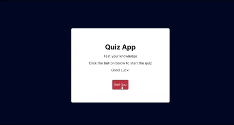
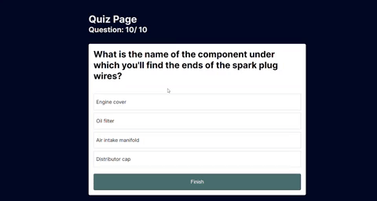

# Quiz App 
## Description 📝
This is a quiz app that allows the user to answer questions and get a score at the end. The user can also retake the quiz with a new set of questions.
## Table of Contents 📖
* [Installation](#installation)
* [Usage](#usage)
* [Dependencies](#dependencies)
## Installation 💾
To install necessary dependencies, run the following command:
```
npm i
```
## Usage 🖥️
To use this app, run the following command:
```
npm build
npm start
```
## Dependencies 🗃️
* [Next.js](https://nextjs.org/)
* [React](https://reactjs.org/)
* [Axios](https://www.npmjs.com/package/axios)
* [Trivia Api](https://the-trivia-api.com)


## Preview 🖥️




